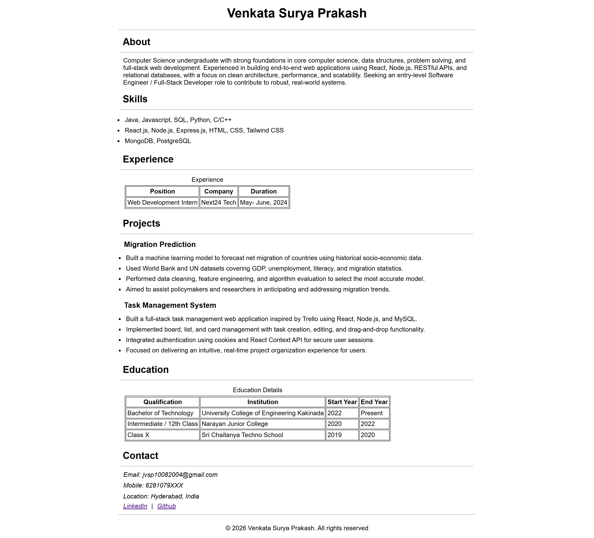

# Venkata Surya Prakash – Resume (HTML, CSS)

This repository contains a **simple, semantic HTML resume** built using plain HTML and CSS.

---

## Overview

This resume is structured using modern HTML5 semantic elements and basic CSS for layout and readability.  
The focus is on clean structure, accessibility, and clarity without using frameworks or JavaScript.

The resume includes the following sections:

- About
- Skills
- Experience
- Projects
- Education
- Contact

---

## 📁 Project Structure

```text
HTML-Resume-Page-Assignment/
├── resume.html
├── style.css
└── README.md
```
## Project Setup

Clone the repository:

```bash
git clone https://github.com/J-VSuryaPrakash/WDC-2026.git
````

Navigate to the project directory:

```bash
cd HTML-Resume-Page-Assignment
```

Open resume.html in a web browser
or run it using Live Server (VS Code extension).

## 📸 Screenshot

Screenshot of the rendered HTML resume in the browser.


